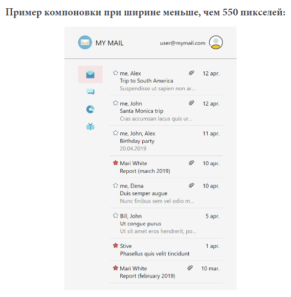

### Задание 1

Реализовать html-страницу с информацией о событии.
Для разной ширины экрана должна быть разная компоновка 
блоков страницы. Обратите внимание, что изменяется нетолько положение блоков, а отступы и размеры шрифтов тоже меняются.

### Запуск

Открываем файл index.html (главная страница)
нажимаем вкладку навигации Articles, тут при изменении размера меняется компоновка и размер шрифта. 

---

### Задание 2

Реализовать html-страницу со статьей и изображениями.
 Страница состоит из двух блоков:

 ■ статья (заголовок и текст);

 ■ изображения с подписями.
 Для разной ширины экрана должна быть разная компоновка 
блоков страницы.

---

### Задание 3
Реализовать html-страницу для почтового клиента.
 Страница состоит из:

 ■ шапка (логотип и имя пользователя);

 ■ боковое меню;

 ■ список писем.

 Для разной ширины экрана должна быть разная компоновка 
блоков страницы.

